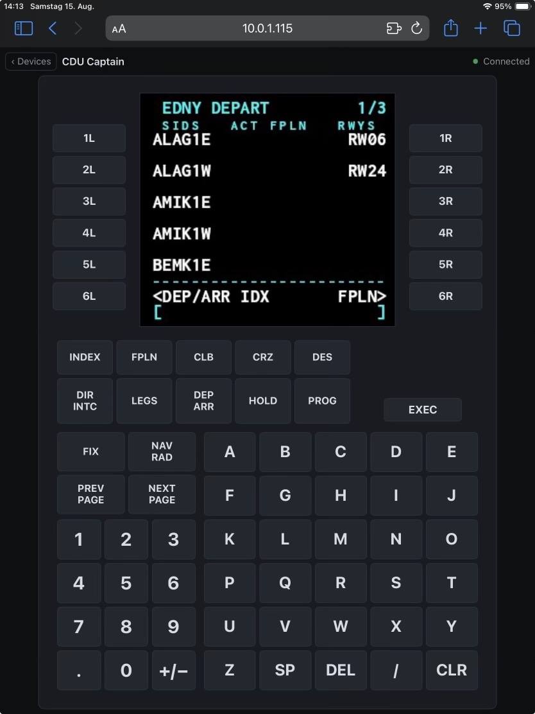

# Welly's Gauge Streamer


Native X-Plane 12 plugin for **macOS, Windows and Linux** that captures the
default Laminar avionics displays — the GNS430/530 and the airliner CDU — and
streams them to a web frontend, where they can be operated by click or touch
instead of via the cockpit popout.


Status: feature complete — the screens stream to the browser and their keys
operate the units in the sim.

## Contents

- [Quick start](#quick-start)
- [Why Gauge Streamer?](#why-gauge-streamer)
- [Watching the stream](#watching-the-stream)
- [Endpoints](#endpoints)
- [Adding a device type](#adding-a-device-type)
- [Security](#security)
- [Known gaps](#known-gaps)
- [For developers](#for-developers)

## Quick start

1. Build and install (or copy a release build) into your X-Plane 12 plugins folder.
2. In X-Plane, open **Plugins → Welly's Gauge Streamer → Stream settings** — it shows the address to type on the tablet, which devices this aircraft has, and the port.
3. On a tablet in the same network, open `http://<your-ip>:8080/` (or `http://localhost:8080/` on this machine).
4. Pick a unit on the selection page, or bookmark `/device/<slug>` for a dedicated screen.

### Requirements

| Platform | Requirement | Tested |
|---|---|---|
| macOS | 12.0+, **Apple Silicon only** — an Intel Mac cannot load this plugin | yes, this is where it is developed |
| Windows | 10 or 11, x64, Visual Studio 2022 to build | the capture path, in a cloud VM |
| Linux | x64, GCC 11+ | **no** — builds on CI, never loaded in the sim |

Building from source additionally needs CMake 3.21+, and NASM on x64 for
libjpeg-turbo's SIMD paths (Apple Silicon uses NEON and needs nothing).

**What "tested" means here.** The developer flies on macOS, so that is the only
platform where every release is used in anger. Windows was verified in a cloud
VM: the plugin loads, the capture works under Vulkan, the stream arrives — but
that machine sees no home network, so LAN access from a tablet and the Windows
firewall prompt are unverified there. **Linux is best effort**: CI proves it
compiles and that the domain tests pass, nothing more. Reports from Linux users
are welcome; a green build is not a promise.

## Why Gauge Streamer?

- **Operate the unit from a tablet.** Click and touch the bezel in the browser instead of hunting for the cockpit popout. A CDU in particular is a thing you type on, which a tablet does better than a popout window.
- **Capture only while someone watches.** With no open stream, the plugin costs X-Plane nothing.
- **Bezel is drawn, not captured.** X-Plane hands out the screen only — the frontend draws the frame, keys, and knobs around it.
- **Reconnects on its own.** After an X-Plane restart or a WLAN dropout, the page reconnects; a dead frontend that looks alive is worse in flight than a visible error.
- **Extensible by data.** A new device type is a bezel JSON plus registry and whitelist entries — no renderer change.

## Watching the stream

`/` is the selection page: one tile per unit, with a sketch of the device, its
name, and whether the loaded aircraft has it. It streams nothing — a Cessna with
a GNS530 and a second GNS430 shows `gns530_1` and `gns430_2` as present and the
rest as absent, a 737 shows its two CDUs and nothing else. Each unit has its own
page at `/device/<slug>`, with the slugs `gns430_1`, `gns430_2`, `gns530_1`,
`gns530_2`, `cdu739_1` and `cdu739_2`, so a tablet can bookmark just its own
screen.

The device page draws the bezel around the stream, laid out like the unit in the
cockpit. The GNS units are landscape: COM and VLOC volume with their push
functions on the left, the C and V frequency flip-flops beside them, CDI, OBS,
MSG, FPL, VNAV (530 only) and PROC in a row under the screen, RNG, D→, MENU, CLR
and ENT down the right, and the two large dual knobs in the bottom corners —
COM/VLOC frequency on the left, chapter and page with CRSR on the right.

The CDU is portrait, as the unit is: the screen up top with six line selects down
each side, the function keys below it, then the number pad beside the letters.
The line selects sit on the screen's own text rows, so `1L` points at the first
data line rather than at the page title. Presses travel over the WebSocket and
reach the sim as the unit's own commands.




That bezel serves every aircraft using X-Plane's `CDU739`, not just the 737 —
the AW139 is the other one tested. An aircraft is free to label the same keys
differently on its own panel, and to leave some of them out: the AW139 calls
`NAV RAD` "RADIO", has no CLB, CRZ, DES, HOLD or FIX at all, and its PERF, PROG
and MENU keys are labelled but wired to nothing. The bezel here carries the full
set, so it can do more than the panel in that cockpit. A green CDU screen in a
3D cockpit is a font texture the aircraft draws from the same datarefs, not a
different device.

Aircraft that bring their own FMC — ZIBO, ToLiss, most payware — compute and
draw it themselves and bind no avionics device at all. There is no framebuffer
to read, so they show as absent and no bezel would help. That is the line this
plugin draws: it serves the devices X-Plane provides, not what an add-on
renders on its own.

With one stream open, expect the sim to give up roughly 4–5 % of its frame rate.
The plugin reads the device's framebuffer back six times a second on X-Plane's
main thread. Cost does not depend on monitor resolution — the device screen is
read at its own fixed size — but a second open stream adds its own share. Close
the tab and the cost goes away. A CDU screen is the cheaper one: at 300×330 it
is about a third of a GNS530's pixels.

**A black CDU screen is usually an electrical problem, not a streaming one.** The
unit only draws when the aircraft has power, so on a cold and dark 737 the stream
runs fine and shows nothing until the GPU or APU is on. `/devices` reporting
`present: true` says the aircraft has the unit, not that it is lit.

## Endpoints

| Endpoint         | Purpose                                                |
|------------------|--------------------------------------------------------|
| `/`              | Selection page, no stream                              |
| `/device/<slug>` | One unit in its bezel                                  |
| `/stream/<slug>` | MJPEG stream of one unit                               |
| `/devices`       | JSON: slug, type, name, and whether the aircraft has it|
| `/control`       | WebSocket: `{"device": "gns530_1", "button": "fpl"}`   |

Button names are the suffix of the unit's own command family: `sim/GPS/g430n*_`
for the GNS units — `fpl`, `menu`, `clr`, `ent`, `cursor`, `zoom_in`, `page_up`,
… — and `sim/FMS/` or `sim/FMS2/` for the captain's and first officer's CDU —
`ls_1l`, `exec`, `dep_arr`, `key_A`, `key_7`, … Note the CDU's letter keys are
upper case: `key_A`, not `key_a`. Only whitelisted names are accepted; anything
else is dropped and logged. Presses are queued and executed on X-Plane's main
thread, never from the network thread.

## Adding a device type

A device's bezel comes from data, never from code. `web/bezels/<type>.json`
gives the screen area, every key with its label and command suffix, and the
geometry in the bezel's own units — the frontend scales that to the viewport
and draws it. The renderer knows four control kinds: `button`, `rocker`, `knob`,
and `grid`. A knob's rings split the face by angle rather than by radius, so a
dual knob becomes four quarter sectors around an optional press in the centre —
outer ring left and right, inner ring up and down, every target wide enough for a
finger in turbulence. A `grid` is a block of equally sized keys in `columns`
columns, which is what a keypad of dozens of keys needs instead of as many
hand-placed boxes; an entry without a command leaves its cell empty.

Two options help where keys get small: `labelSize` overrides a control's label
size, given in bezel units like every other measure, and a `\n` in a label
breaks it across lines.

Where a keyboard is at hand it can drive the keys. A caption of a single
character answers to itself, so a letter pad needs no annotation; anything else
names its key with `shortcut`, using the name the browser reports (`" "`,
`"Backspace"`, `"Delete"`). Keys that name none stay mouse and touch only —
which is why Enter does not fire EXEC.

A device that hands out more black margin than it uses can give it back:
`crop` in the screen definition says how many pixels of the capture to drop at
the top and bottom. The screen box then carries the ratio of what is left, and
the bezel gets shorter — which makes everything on it larger. The CDU drops 32
and 24 pixels of its 330.

So a G1000 or an MCP takes three steps and no renderer change:

1. `web/bezels/g1000.json` — the layout
2. a `device_registry` entry with the new `type` and its command prefix
3. that type's button whitelist in `command_catalog` — the whitelist is per
   type, so a different command family stays out of the GNS units' reach

The selection page draws its tile picture from the same JSON, so a new type
brings its own likeness along.

## Security

**The server has no authentication.** It binds to `0.0.0.0` on purpose — a
tablet as a second screen is the point of this plugin — so anyone on the same
network can watch your avionics and operate them. Use it on a network you trust,
or restrict the server to this machine:

```
# <X-Plane>/Output/xp_gauge_streamer/settings.cfg
bind_address = 127.0.0.1
port = 8080
```

`make install` puts the default file there and never overwrites an existing one;
the plugin also writes it on first start if it is missing. The port can also be
set in the plugin window. Settings live under `Output/` so a plugin update leaves
them alone. Changes take effect on the next X-Plane start.

## Known gaps

**Windows: the firewall prompt.** The first time the server starts, Windows asks
whether to allow the port. Decline it and the tablet reaches nothing, while
everything inside the sim looks perfectly fine — including the address in the
plugin window. If the page loads on `localhost` but not from the tablet, this is
the first thing to check.

**Windows: SmartScreen.** The `.xpl` from a GitHub release is unsigned and may be
quarantined. A code-signing certificate does not pay for a hobby plugin; unblock
the file in its properties if Windows holds it back.

**Linux: no Copy button.** The plugin window shows the URL but omits the copy
button, because ImGui has no clipboard implementation there and it would only
appear to work. Shelling out to `xclip` or `wl-copy` would add a dependency that
a Steam Deck does not have.

---

## For developers

Project context for AI assistants: [.cursor/rules/xp-gauge-streamer.mdc](.cursor/rules/xp-gauge-streamer.mdc) (Cursor) and [CLAUDE.md](CLAUDE.md) (Claude Code).

### Build from source

```bash
make setup    # SDK, civetweb, Catch2, json, ImGui, libjpeg-turbo → sdk/ + vendor/
make build    # Configure + compile → build/xp_gauge_streamer.xpl
make test     # Run the Catch2 unit tests
make install  # Code-sign and copy plugin, web/ and default settings into X-Plane
```

`make help` lists every target. Neither `sdk/` nor `vendor/` is committed — both
are populated by `make setup`.

`make install` deploys to the path in the `XPLANE_ROOT` variable at the top of
the `Makefile`; adjust it for your installation. It picks the platform folder
itself — `mac_x64`, `win_x64` or `lin_x64` — and signs only on macOS. X-Plane's
name for 64-bit macOS plugins is `mac_x64` even for an arm64 binary; the name
predates Apple Silicon and does not describe the architecture.

On Windows the supported route is CMake directly or the CI artifact — `make`
there needs MSYS or Git Bash:

```cmd
cmake -B build -A x64
cmake --build build --config Release
```

### Code quality

```bash
make format    # clang-format over src/
make lint      # clang-tidy (bugprone-* and performance-* are errors)
make sanitize  # unit tests under ASan + UBSan
```

The `.xpl` plugin is deliberately not ASan-instrumented — ASan inside the X-Plane
process is fragile on macOS arm64. Use Instruments.app against the running
X-Plane process for in-sim memory analysis.

### Project layout

```
src/         plugin sources (X-Plane SDK)
config/      default settings.cfg — installed into <X-Plane>/Output/
images/      screenshots for this README
web/         frontend — no framework, no build step
web/bezels/  one JSON per device type: screen area, keys, geometry, commands
tests/       Catch2 unit tests — never link the SDK, domain logic only
sdk/         X-Plane SDK headers + stub frameworks   (make setup)
vendor/      civetweb, nlohmann/json, Dear ImGui, Catch2, libjpeg-turbo  (make setup)
```

### Dependencies

| Dependency    | Version | Source              | Purpose                            |
|---------------|---------|---------------------|------------------------------------|
| X-Plane SDK   | 4.3.0   | `make setup`        | Plugin API, Avionics capture       |
| civetweb      | 1.16    | `make setup`        | Embedded HTTP server + WebSocket   |
| libjpeg-turbo | 3.2.0   | `make setup`        | JPEG encoding (SIMD: NEON or x86)  |
| nlohmann/json | 3.12.0  | `make setup`        | Parsing control messages           |
| Dear ImGui    | 1.92.8  | `make setup`        | In-sim settings window             |
| Catch2        | 3.15.3  | `make setup`        | Unit tests                         |

civetweb is used over mongoose because its MIT license matches this project's.
libjpeg-turbo is linked statically so the `.xpl` stays self-contained.

### Release

```bash
make release VERSION=0.3.0   # commits VERSION.txt, tags, pushes
```

Pushing a `v*` tag runs lint + build on CI and publishes a ZIP to the releases page.

## License

MIT — see [LICENSE](LICENSE).
