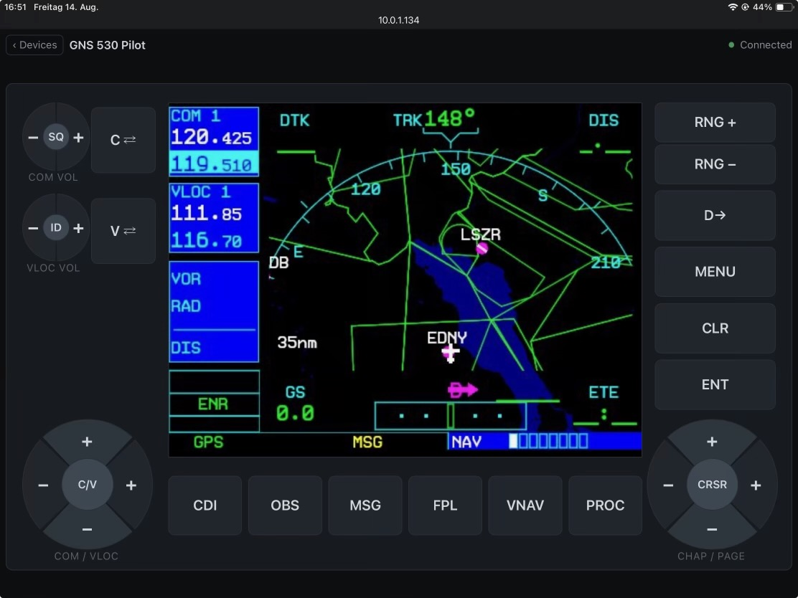

# xp_gauge_streamer

Shown in X-Plane as **Welly's Gauge Streamer**.


Native X-Plane 12 plugin for **macOS (Apple Silicon)** that captures the default
Laminar GNS430/530 display and streams it to a web frontend, where it can be
operated by click or touch instead of via the cockpit popout.



Status: feature complete — the GNS screen streams to the browser and its keys
operate the unit in the sim.

## Contents

- [Quick start](#quick-start)
- [Why Gauge Streamer?](#why-gauge-streamer)
- [Watching the stream](#watching-the-stream)
- [Endpoints](#endpoints)
- [Adding a device type](#adding-a-device-type)
- [Security](#security)
- [For developers](#for-developers)

## Quick start

1. Build and install (or copy a release build) into your X-Plane 12 plugins folder.
2. In X-Plane, open **Plugins → Welly's Gauge Streamer → Stream settings** — it shows the address to type on the tablet, which devices this aircraft has, and the port.
3. On a tablet in the same network, open `http://<mac-ip>:8080/` (or `http://localhost:8080/` on this machine).
4. Pick a unit on the selection page, or bookmark `/device/<slug>` for a dedicated screen.

**Requirements:** macOS 12.0+ (arm64) · X-Plane 12 · CMake 3.21+ · Homebrew

## Why Gauge Streamer?

- **Operate the GNS from a tablet.** Click and touch the bezel in the browser instead of hunting for the cockpit popout.
- **Capture only while someone watches.** With no open stream, the plugin costs X-Plane nothing.
- **Bezel is drawn, not captured.** X-Plane hands out the GNS screen only — the frontend draws the frame, keys, and knobs around it.
- **Reconnects on its own.** After an X-Plane restart or a WLAN dropout, the page reconnects; a dead frontend that looks alive is worse in flight than a visible error.
- **Extensible by data.** A new device type is a bezel JSON plus registry and whitelist entries — no renderer change.

## Watching the stream

`/` is the selection page: one tile per unit, with a sketch of the device, its
name, and whether the loaded aircraft has it. It streams nothing — a panel with
a GNS530 and a second GNS430 shows `gns530_1` and `gns430_2` as present and the
other two as absent. Each unit has its own page at `/device/<slug>`, with the
slugs `gns430_1`, `gns430_2`, `gns530_1`, and `gns530_2`, so a tablet can
bookmark just its own screen.

The device page draws the bezel around the stream, laid out like the unit in the
cockpit: COM and VLOC volume with their push functions on the left, the C and V
frequency flip-flops beside them, CDI, OBS, MSG, FPL, VNAV (530 only) and PROC in
a row under the screen, RNG, D→, MENU, CLR and ENT down the right, and the two
large dual knobs in the bottom corners — COM/VLOC frequency on the left, chapter
and page with CRSR on the right. Presses travel over the WebSocket and reach the
sim as the unit's own commands.

With one stream open, expect the sim to give up roughly 4–5 % of its frame rate.
The plugin reads the device's framebuffer back six times a second on X-Plane's
main thread. Cost does not depend on monitor resolution — the device screen is
read at its own fixed size — but a second open stream adds its own share. Close
the tab and the cost goes away.

## Endpoints

| Endpoint         | Purpose                                                |
|------------------|--------------------------------------------------------|
| `/`              | Selection page, no stream                              |
| `/device/<slug>` | One unit in its bezel                                  |
| `/stream/<slug>` | MJPEG stream of one unit                               |
| `/devices`       | JSON: slug, type, name, and whether the aircraft has it|
| `/control`       | WebSocket: `{"device": "gns530_1", "button": "fpl"}`   |

Button names follow X-Plane's `sim/GPS/g430n*_` commands — `fpl`, `menu`,
`clr`, `ent`, `cursor`, `zoom_in`, `page_up`, … Only whitelisted names are
accepted; anything else is dropped and logged. Presses are queued and executed
on X-Plane's main thread, never from the network thread.

## Adding a device type

A device's bezel comes from data, never from code. `web/bezels/<type>.json`
gives the screen area, every key with its label and command suffix, and the
geometry in the bezel's own units — the frontend scales that to the viewport
and draws it. The renderer knows three control kinds: `button`, `rocker`, and
`knob`. A knob's rings split the face by angle rather than by radius, so a dual
knob becomes four quarter sectors around an optional press in the centre — outer
ring left and right, inner ring up and down, every target wide enough for a
finger in turbulence.

So a G1000 or an MCP takes three steps and no renderer change:

1. `web/bezels/g1000.json` — the layout
2. a `device_registry` entry with the new `type` and its command prefix
3. that type's button whitelist in `command_catalog` — the whitelist is per
   type, so a different command family stays out of the GNS units' reach

The selection page draws its tile picture from the same JSON, so a new type
brings its own likeness along.

## Security

**The server has no authentication.** It binds to `0.0.0.0` on purpose — a
tablet as a second screen is the point of this plugin — so anyone on the same
network can watch the GNS and operate it. Use it on a network you trust, or
restrict the server to this machine:

```
# <X-Plane>/Output/xp_gauge_streamer/settings.cfg
bind_address = 127.0.0.1
port = 8080
```

`make install` puts the default file there and never overwrites an existing one;
the plugin also writes it on first start if it is missing. The port can also be
set in the plugin window. Settings live under `Output/` so a plugin update leaves
them alone. Changes take effect on the next X-Plane start.

---

## For developers

Project context for AI assistants: [.cursor/rules/xp-gauge-streamer.mdc](.cursor/rules/xp-gauge-streamer.mdc) (Cursor) and [CLAUDE.md](CLAUDE.md) (Claude Code).

### Build from source

```bash
make setup    # SDK, civetweb, Catch2, json, ImGui → sdk/ + vendor/; libjpeg-turbo via Homebrew
make build    # Configure + compile → build/xp_gauge_streamer.xpl
make test     # Run the Catch2 unit tests
make install  # Code-sign and copy plugin, web/ and default settings into X-Plane
```

`make help` lists every target. Neither `sdk/` nor `vendor/` is committed — both
are populated by `make setup`.

`make install` deploys to the path in the `XPLANE_ROOT` variable at the top of
the `Makefile`; adjust it for your installation. The folder name `mac_x64` is
X-Plane's name for 64-bit macOS plugins and applies to arm64 binaries too.

### Code quality

```bash
make format    # clang-format over src/
make lint      # clang-tidy (bugprone-* and performance-* are errors)
make sanitize  # unit tests under ASan + UBSan
```

The `.xpl` plugin is deliberately not ASan-instrumented — ASan inside the X-Plane
process is fragile on macOS arm64. Use Instruments.app against the running
X-Plane process for in-sim memory analysis.

### Project layout

```
src/         plugin sources (X-Plane SDK)
config/      default settings.cfg — installed into <X-Plane>/Output/
images/      screenshots for this README
web/         frontend — no framework, no build step
web/bezels/  one JSON per device type: screen area, keys, geometry, commands
tests/       Catch2 unit tests — never link the SDK, domain logic only
sdk/         X-Plane SDK headers + stub frameworks   (make setup)
vendor/      civetweb, nlohmann/json, Dear ImGui, Catch2  (make setup)
```

### Dependencies

| Dependency    | Version | Source              | Purpose                            |
|---------------|---------|---------------------|------------------------------------|
| X-Plane SDK   | 4.3.0   | `make setup`        | Plugin API, Avionics capture       |
| civetweb      | 1.16    | `make setup`        | Embedded HTTP server + WebSocket   |
| libjpeg-turbo | latest  | Homebrew            | JPEG encoding (arm64/NEON)         |
| nlohmann/json | 3.12.0  | `make setup`        | Parsing control messages           |
| Dear ImGui    | 1.92.8  | `make setup`        | In-sim settings window             |
| Catch2        | 3.15.3  | `make setup`        | Unit tests                         |

civetweb is used over mongoose because its MIT license matches this project's.
libjpeg-turbo is linked statically so the `.xpl` stays self-contained.

### Release

```bash
make release VERSION=0.3.0   # commits VERSION.txt, tags, pushes
```

Pushing a `v*` tag runs lint + build on CI and publishes a ZIP to the releases page.

## License

MIT — see [LICENSE](LICENSE).
